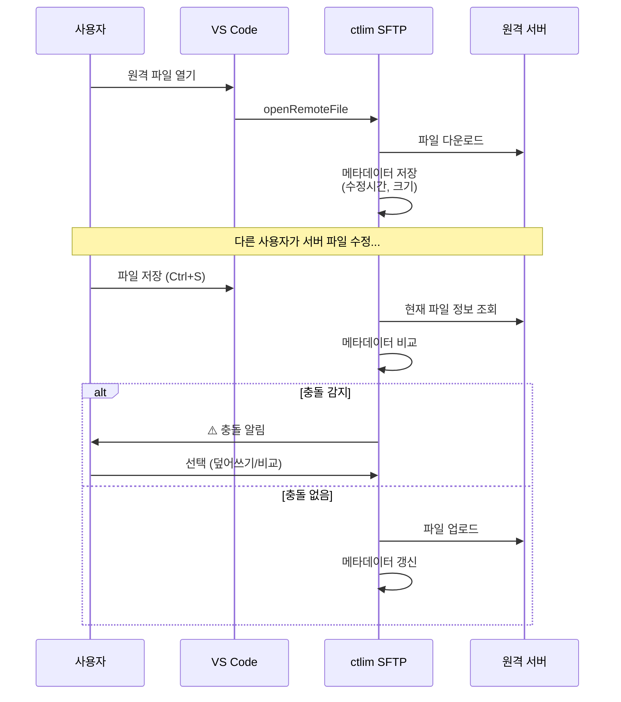

# ctlim SFTP

> 간편하고 강력한 VS Code SFTP/SSH 파일 동기화 확장 프로그램

[](https://github.com/ctlim2/ctlimsftp)
[](LICENSE)

**저장 시 자동 업로드**와 **지능형 충돌 감지**로 원격 서버와 로컬 파일을 안전하게 동기화하세요.

---

## ✨ 주요 특징

### 🚀 핵심 기능
- **저장 시 자동 업로드** - `Ctrl+S`만 누르면 원격 서버에 즉시 반영
- **충돌 감지 시스템** - 원격 파일 변경 감지 시 덮어쓰기/비교/취소 선택 가능
- **다중 서버 관리** - 개발/운영 등 여러 서버를 하나의 설정으로 관리
- **원격 파일 탐색** - Activity Bar에서 서버 파일 구조 실시간 탐색

### 🔐 보안 & 호환성
- **SSH 키 인증 지원** - Password 또는 Private Key (passphrase 포함)
- **구형 서버 호환** - Legacy SSH 알고리즘 지원 (DES, SHA1 등)
- **메타데이터 기반 동기화** - 파일 수정 시간 추적으로 안전한 업로드

### 💡 개발 편의성
- **다른 이름으로 저장** - 원격 경로를 직접 입력하거나 트리에서 선택
- **Diff 비교** - 충돌 시 로컬/원격 파일을 시각적으로 비교
- **선택적 무시** - `.git`, `node_modules` 등 불필요한 파일 제외
- **재연결 자동화** - 연결 끊김 시 자동 재연결 시도

### 📊 모니터링 & 분석
- **전송 히스토리** - 업로드/다운로드 기록 자동 저장 (최근 100개)
- **전송 통계** - 전송량, 속도, 성공률 실시간 분석
- **실패 재시도** - 실패한 전송을 원클릭으로 재시도
- **서버별 통계** - 서버별 전송 통계 및 성능 비교

---

## 📦 설치

### 방법 1: VS Code Marketplace
1. `Ctrl+Shift+X` (확장 탭 열기)
2. **"ctlim SFTP"** 검색
3. **Install** 클릭

### 방법 2: 명령 줄
```bash
code --install-extension ctlim.ctlim-sftp
```

---

## 🚀 빠른 시작 (3분 완성)

### 1️⃣ 설정 파일 생성

**Command Palette** 열기:
- Windows/Linux: `Ctrl+Shift+P`
- macOS: `Cmd+Shift+P`

명령어 입력: **`ctlim SFTP: Config`**

→ `.vscode/ctlim-sftp.json` 자동 생성 ✅

---

### 2️⃣ 서버 정보 입력

생성된 설정 파일에 서버 정보를 입력하세요:

#### 기본 설정 (Password 인증)
```json
{
    "name": "My Development Server",
    "host": "host ip",
    "protocol": "sftp",
    "port": 22,
    "username": "username",
    "password": "password",
    "remotePath": "/var/www/html",
    "context": "d:/MyProject/Project/vss1",
    "uploadOnSave": true,
    "downloadOnOpen": true,
    "downloadBackup": ".vscode/.sftp-backup"
    "ignore": [
      ".vscode",
      ".git",
      "node_modules",
      "*.log"
    ]
}

```

#### 다중 서버 설정 (그룹 기능 포함)
```json
[
  {
      "name": "개발 서버 1",
      "group": "개발 환경",
      "host": "dev1.example.com",
      "protocol": "sftp",
      "port": 22,
      "username": "username",
      "password": "password",
      "remotePath": "/var/www/html",
      "context": "d:/MyProject/Project/dev1",
      "uploadOnSave": true,
      "downloadOnOpen": true,
      "ignore": [
        ".vscode",
        ".git",
        "node_modules",
        "*.log"
      ]
  },
  {
      "name": "개발 서버 2",
      "group": "개발 환경",
      "host": "dev2.example.com",
      "protocol": "sftp",
      "port": 22,
      "username": "username",
      "password": "password",
      "remotePath": "/var/www/html",
      "context": "d:/MyProject/Project/dev2",
      "uploadOnSave": true,
      "downloadOnOpen": true,
      "ignore": [
        ".vscode",
        ".git",
        "node_modules",
        "*.log"
      ]
  },
  {
      "name": "운영 서버",
      "group": "운영 환경",
      "host": "prod.example.com",
      "protocol": "sftp",
      "port": 22,
      "username": "username",
      "password": "password",
      "remotePath": "/var/www/html",
      "context": "d:/MyProject/Project/prod",
      "uploadOnSave": false,
      "downloadOnOpen": true,
      "ignore": [
        ".vscode",
        ".git",
        "node_modules",
        "*.log"
      ]
  }
]
```

---

### 3️⃣ 서버 연결 및 사용

1. **Activity Bar**에서 ctlim SFTP 아이콘 클릭 (왼쪽 사이드바)
2. 서버 또는 그룹을 펼쳐서 서버 이름 클릭 → 자동 연결
3. 파일 트리 탐색 및 파일 더블클릭 → 자동 다운로드 & 편집
4. 파일 저장 (`Ctrl+S`) → 자동 업로드 ✨

**그룹별 서버 표시**:
```
📁 개발 환경
  ☁ 개발 서버 1
  ☁ 개발 서버 2
📁 운영 환경
  ☁ 운영 서버
```

---

## ⚙️ 설정 옵션 상세

| 옵션 | 타입 | 기본값 | 필수 | 설명 |
|------|------|--------|------|------|
| `name` | string | - | ❌ | 서버 식별 이름 (트리 뷰에 표시) |
| `group` | string | - | ❌ | 서버 그룹 이름 (같은 그룹끼리 묶여 표시) |
| `context` | string | `"./"` | ❌ | 로컬 워크스페이스 루트 (상대/절대 경로) |
| `host` | string | - | ✅ | SFTP 서버 호스트 주소 |
| `port` | number | `22` | ❌ | SSH/SFTP 포트 번호 |
| `username` | string | - | ✅ | 서버 로그인 사용자명 |
| `password` | string | - | ❌ | 비밀번호 (또는 `privateKey` 사용) |
| `remotePath` | string | `"/"` | ❌ | 원격 서버 기본 경로 |
| `uploadOnSave` | boolean | `false` | ❌ | 저장 시 자동 업로드 활성화 |
| `downloadBackup` | string | - | ❌ | 다운로드 시 백업 경로 (상대/절대 경로) |
| `ignore` | string[] | `[]` | ❌ | 업로드 제외 패턴 (glob 지원) |
| `connectTimeout` | number | `10000` | ❌ | 연결 타임아웃 (밀리초) |
| `readyTimeout` | number | `20000` | ❌ | 준비 타임아웃 (밀리초) |
| `keepaliveInterval` | number | `10000` | ❌ | Keep-Alive 간격 (밀리초) |
| `keepaliveCountMax` | number | `3` | ❌ | Keep-Alive 최대 재시도 횟수 |

### 🔒 인증 방법 선택

1. **Password 인증** (간단)
   ```json
   {
     "username": "user",
     "password": "your-password"
   }
   ```

2. **비밀번호 생략** (런타임 입력)
   ```json
   {
     "username": "user"
     // password 필드 없음 → 연결 시 입력 창 표시
   }
   ```

---

## 🔍 충돌 감지 시스템

ctlim SFTP는 메타데이터 기반 충돌 감지로 원격 파일의 안전성을 보장합니다.

### 작동 원리



### 충돌 감지 플로우

1. **다운로드 시**: 원격 파일의 **수정 시간**과 **크기**를 로컬에 메타데이터로 저장
   - 저장 위치: `.vscode/.sftp-metadata/`
   
2. **업로드 시**: 원격 서버의 현재 파일 정보와 메타데이터 비교
   
3. **충돌 발견 시**: 모달 대화상자 표시
   ```
   ⚠️ 충돌 감지!
   
   파일이 서버에서 수정되었습니다: test.php
   
   로컬 변경사항으로 덮어쓰시겠습니까?
   
   [덮어쓰기]  [비교]  [Cancel]
   ```

### 사용자 옵션

- **덮어쓰기** 🔄
  - 로컬 파일로 원격 파일 강제 덮어쓰기
  - 원격 변경사항은 손실됩니다

- **비교** 📊
  - Diff 뷰로 로컬 ↔ 원격 파일 비교
  - 변경사항 확인 후 수동 병합 가능

- **Cancel** ❌
  - 업로드 중단
  - 로컬 파일은 그대로 유지

---

## � 자동 재연결 시스템

ctlim SFTP는 안정적인 연결 유지를 위해 자동 재연결 기능을 제공합니다.

### Keep-Alive 메커니즘

1. **주기적 연결 확인**: 설정된 간격(기본 10초)마다 서버 연결 상태 체크
2. **자동 재연결**: 연결 끊김 감지 시 자동으로 재연결 시도
3. **사용자 알림**: 재연결 성공/실패 시 알림 메시지 표시

### 연결 설정 옵션

```json
{
  "connectTimeout": 10000,        // 연결 시도 타임아웃 (10초)
  "readyTimeout": 20000,          // 연결 준비 타임아웃 (20초)
  "keepaliveInterval": 10000,     // Keep-Alive 체크 간격 (10초)
  "keepaliveCountMax": 3          // 최대 재시도 횟수
}
```

### 재연결 동작

- **연결 끊김 감지**: Keep-Alive 체크 실패 시
- **자동 재연결 시도**: 백그라운드에서 즉시 시도
- **성공 시**: "🔄 SFTP 재연결 성공" 알림
- **실패 시**: "⚠️ SFTP 재연결 실패" 경고 + 수동 재연결 안내

---

## �💡 사용 시나리오

### 시나리오 1: 개발 서버 실시간 테스트

```json
{
  "name": "Dev Server",
  "host": "dev.mysite.com",
  "remotePath": "/home/dev/public_html",
  "uploadOnSave": true,
  "ignore": [".git", "node_modules", "*.log"]
}
```

**워크플로우**:
1. 로컬에서 PHP/HTML 파일 수정
2. `Ctrl+S` 저장 → 자동 업로드
3. 브라우저에서 즉시 결과 확인 ✨

---

### 시나리오 2: 운영 서버 안전 배포

```json
{
  "name": "Production",
  "host": "prod.mysite.com",
  "remotePath": "/var/www/production",
  "uploadOnSave": false,
}
```

**워크플로우**:
1. 로컬 개발 완료 (`uploadOnSave: false`로 자동 업로드 방지)
2. 파일 우클릭 → `ctlim SFTP: Upload File`로 수동 업로드
3. 충돌 감지로 안전성 확보 🛡️

---

### 시나리오 3: 다중 환경 관리

```json
[
  {
    "name": "🧪 Test",
    "context": "./",
    "host": "test.server",
    "remotePath": "/home/test"
  },
  {
    "name": "🚀 Staging",
    "context": "./dist",
    "host": "staging.server",
    "remotePath": "/var/www/staging"
  },
  {
    "name": "🔥 Production",
    "context": "./dist",
    "host": "prod.server",
    "remotePath": "/var/www/production"
  }
]
```

**워크플로우**:
- Activity Bar에서 환경 선택 후 개별 연결/배포
- 각 서버별 독립적인 메타데이터 관리

---

## 🛠️ 고급 기능

### 1. 다른 이름으로 저장

에디터에서 우클릭 → `ctlim SFTP: Save As Remote Path`

#### 옵션 A: 직접 입력
```
원격 저장 경로를 입력하세요:
/var/www/html/backup/test_v2.php
```

#### 옵션 B: 트리 선택
```
현재 위치: /var/www/html
├── 📁 public/
├── 📁 admin/
└── 📁 backup/   ← 선택
    └── test_v2.php로 저장
```

---

### 2. 파일 무시 패턴

```json
{
  "ignore": [
    ".git",
    ".vscode",
    "node_modules",
    "*.log",
    "*.tmp",
    "**/.DS_Store",
    "**/Thumbs.db"
  ]
}
```

**지원 패턴**:
- `node_modules` - 폴더명 정확히 일치
- `*.log` - 확장자 매칭
- `**/.DS_Store` - 모든 하위 디렉토리

---

### 3. Context 경로 활용

서로 다른 로컬 폴더를 각기 다른 원격 경로에 매핑:

```json
[
  {
    "name": "Frontend",
    "context": "./client",
    "remotePath": "/var/www/frontend"
  },
  {
    "name": "Backend",
    "context": "./server",
    "remotePath": "/var/www/backend"
  }
]
```

---

### 4. 다운로드 백업 기능

원격 파일을 다운로드할 때 기존 로컬 파일을 자동으로 백업합니다.

#### 설정

```json
{
  "downloadBackup": ".vscode/.sftp-backup"  // 상대 경로
}
```

또는 절대 경로 지정:

```json
{
  "downloadBackup": "D:/MyBackup/sftp-backup"  // 절대 경로
}
```

#### 백업 방식

- **저장 위치**: 원격 경로 구조를 그대로 재현
- **폴더 구조**: 원격 서버의 디렉토리 구조가 백업 폴더에 유지됨
- **파일명 형식**: `파일명.YYYY-MM-DD_HH-mm-ss.backup`
- **자동 정리**: 파일당 최근 5개 백업만 유지

#### 예시

원격 파일: `/var/www/html/data/test.php`

백업 파일:
```
.vscode/.sftp-backup/
└── var/
    └── www/
        └── html/
            └── data/
                ├── test.php.2024-12-24_10-30-45.backup
                ├── test.php.2024-12-23_15-43-20.backup
                └── test.php.2024-12-22_09-12-30.backup
```

#### 사용 시나리오

1. **실수 방지**: 다운로드 전 로컬 수정사항 백업
2. **버전 관리**: 원격 파일의 여러 버전 보존
3. **충돌 복구**: 다운로드 후 문제 발생 시 이전 버전 복원

---

### 5. 전송 히스토리 및 통계

모든 파일 전송 활동을 자동으로 기록하고 분석합니다.

#### 전송 히스토리 보기

**Command Palette**: `ctlim SFTP: View Transfer History`

```
✅ 📤 config.php
   Dev Server | 2.5 KB | 512 KB/s
   성공 | 2024-12-24 14:30:45

❌ 📥 database.php
   Prod Server | 15 KB | N/A
   실패 | 2024-12-24 14:28:12 | ❌ Connection timeout
```

- **성공 기록**: 파일명, 서버, 크기, 전송 속도, 시간
- **실패 기록**: 에러 메시지 포함
- **재시도**: 실패한 전송 선택 → 원클릭 재시도

#### 전송 통계 보기

**Command Palette**: `ctlim SFTP: View Transfer Statistics`

```
📊 전송 통계 (Dev Server)

📤 업로드: 127개
📥 다운로드: 43개
✅ 성공: 165개
❌ 실패: 5개
📈 성공률: 97.1%
💾 총 전송량: 2.8 MB
⚡ 평균 속도: 485 KB/s
```

- **서버별 통계**: 각 서버의 전송 성능 비교
- **전체 통계**: 모든 서버의 종합 통계
- **성공률 분석**: 전송 신뢰성 확인

#### 히스토리 삭제

**Command Palette**: `ctlim SFTP: Clear Transfer History`

- 모든 전송 기록 삭제
- 통계 데이터 초기화

#### 자동 기록 범위

- ✅ 업로드: 저장 시 자동, 수동 업로드, 동기화
- ✅ 다운로드: 원격 파일 열기, 수동 다운로드, 동기화
- ✅ 재연결: 연결 끊김 후 재시도 포함
- ✅ 실패: 에러 메시지 및 타임스탬프 기록

#### 저장 위치

- **파일**: `.vscode/.sftp-history.json`
- **최대 저장**: 최근 100개 기록
- **자동 정리**: 오래된 기록 자동 삭제

---
### 6. 컨텍스트 메뉴 기능

원격 파일/폴더를 우클릭하여 다양한 작업을 수행할 수 있습니다.

#### Copy Remote Path (원격 경로 복사)

원격 파일의 전체 경로를 클립보드에 복사합니다.

**사용법**:
1. Activity Bar에서 원격 파일/폴더 우클릭
2. `Copy Remote Path` 선택
3. 클립보드에 경로 복사됨

**예시**:
```
복사된 경로: /var/www/html/public/index.php
```

**활용 시나리오**:
- SSH 터미널에서 파일 경로 붙여넣기
- 다른 도구나 문서에 경로 공유
- 스크립트 작성 시 경로 참조

#### Open in Browser (브라우저에서 열기)

웹 서버의 파일을 브라우저에서 바로 열어 확인할 수 있습니다.

**사용법**:
1. 원격 파일 우클릭
2. `Open in Browser` 선택
3. 웹 URL 입력 (최초 1회) 또는 설정에서 자동 로드
4. 브라우저에서 파일 열림

**설정에 웹 URL 추가** (선택사항):
```json
{
  "name": "Web Server",
  "host": "example.com",
  "remotePath": "/var/www/html",
  "webUrl": "http://example.com"  // 추가
}
```

**URL 변환 예시**:
```
원격 경로: /var/www/html/admin/dashboard.php
웹 URL: http://example.com
→ 브라우저: http://example.com/admin/dashboard.php
```

**활용 시나리오**:
- PHP/HTML 파일 수정 후 즉시 브라우저에서 확인
- 웹 서버 디버깅 및 테스트
- 프론트엔드 변경사항 실시간 검증

#### New File / New Folder (새 파일/폴더 생성)

원격 서버에 직접 파일이나 폴더를 생성할 수 있습니다.

**사용법**:
1. 서버 또는 원격 폴더 우클릭
2. `New File` 또는 `New Folder` 선택
3. 파일/폴더 이름 입력
4. 원격 서버에 즉시 생성됨

**활용 시나리오**:
- 빠른 테스트 파일 생성
- 새 디렉토리 구조 설정
- 로컬에서 만들지 않고 원격에 직접 생성

---
## ❓ FAQ (자주 묻는 질문)

### Q1: SSH 연결이 안 돼요
**A**: 
1. 호스트 주소와 포트 확인 (기본 22)
2. 방화벽 설정 확인
3. SSH 키 권한 확인 (Windows: `icacls`, Linux: `chmod 600`)
4. 구형 서버는 자동으로 호환 알고리즘 적용됨

### Q2: 비밀번호를 매번 입력해야 하나요?
**A**: 설정 파일의 `password` 필드를 **비워두면** 연결 시 한 번만 입력합니다. 

### Q3: 충돌 감지가 작동하지 않아요
**A**: 
1. 파일을 먼저 `ctlim SFTP: Open Remote File`로 다운로드
2. 메타데이터 파일 확인: `.vscode/.sftp-metadata/`
3. 원격 파일을 직접 수정한 경우에만 충돌 감지

### Q4: 여러 서버에 동시 연결 가능한가요?
**A**: **가능합니다!** Activity Bar에서 여러 서버를 각각 클릭하여 연결하세요.

---

## 🐛 문제 해결

### 연결 끊김 문제
증상: "서버 연결이 끊어졌습니다" 메시지

**해결책**:
1. 서버 타임아웃 설정 확인
2. 네트워크 안정성 확인
3. **자동 재연결** - 대화상자에서 "연결" 클릭

### 업로드 실패
증상: "❌ 업로드 실패" 메시지

**확인 사항**:
1. 원격 경로 권한 (`chmod`, `chown`)
2. 디스크 공간 확인
3. 파일명 특수문자 제거

### 메타데이터 손상
증상: 충돌 감지 오작동

**해결책**:
```powershell
# Windows
Remove-Item -Recurse .vscode\.sftp-metadata\

# Linux/Mac
rm -rf .vscode/.sftp-metadata/
```
파일을 다시 다운로드하여 메타데이터 재생성

---

## 🔗 링크 및 리소스

- 📦 **GitHub Repository**: [github.com/ctlim2/ctlimsftp](https://github.com/ctlim2/ctlimsftp)
- 🐛 **Issue Tracker**: [github.com/ctlim2/ctlimsftp/issues](https://github.com/ctlim2/ctlimsftp/issues)
- 📝 **Changelog**: [CHANGELOG.md](CHANGELOG.md)
- 📖 **Architecture**: [docs/architecture.md](docs/architecture.md)

---

## 🤝 기여하기

버그 리포트, 기능 제안, Pull Request 환영합니다!

1. Fork the repository
2. Create your feature branch (`git checkout -b feature/AmazingFeature`)
3. Commit your changes (`git commit -m 'Add some AmazingFeature'`)
4. Push to the branch (`git push origin feature/AmazingFeature`)
5. Open a Pull Request

---

## 📄 라이선스

MIT License - 자세한 내용은 [LICENSE](LICENSE) 파일 참조

Copyright (c) 2024 ctlim2

---

## 🌟 지원

이 프로젝트가 유용하다면 ⭐ Star를 눌러주세요!

**개발자**: ctlim  
**버전**: 0.2.9  
**마지막 업데이트**: 2024-12-24
