# ctlim SFTP

**English** | [한국어](README.ko.md)

> Simple and Powerful VS Code SFTP/SSH File Synchronization Extension

[](https://github.com/ctlim2/ctlimsftp)
[](LICENSE)

[충돌 감지]


[bookmark]


Safely synchronize remote servers and local files with **Auto Upload on Save** and **Intelligent Conflict Detection**.

---

## ✨ Key Features

### 🚀 Core Functionality
- **Auto Upload on Save** - Press `Ctrl+S` to instantly sync to remote server
- **Conflict Detection System** - Choose to overwrite/compare/cancel when remote file changes detected
- **Multi-Server Management** - Manage multiple servers (dev/production) in one configuration
- **Remote File Explorer** - Browse server file structure in real-time from Activity Bar

### 🔐 Security & Compatibility
- **SSH Key Authentication** - Supports Password or Private Key (with passphrase)
- **Legacy Server Support** - Compatible with legacy SSH algorithms (DES, SHA1, etc.)
- **Metadata-Based Sync** - Safe uploads with file modification time tracking

### 💡 Developer Convenience
- **Smart Bookmarks** - Favorite frequently used files/folders
- **Save As Remote** - Enter remote path directly or select from tree
- **Diff Comparison** - Visually compare local/remote files on conflict
- **Selective Ignore** - Exclude unnecessary files like `.git`, `node_modules`
- **Auto Reconnection** - Automatically retry on connection loss

### 📊 Monitoring & Analysis
- **Transfer History** - Auto-save upload/download records (last 100)
- **Transfer Statistics** - Real-time analysis of transfer volume, speed, success rate
- **Retry Failed Transfers** - One-click retry for failed transfers
- **Server Statistics** - Transfer stats and performance comparison by server

### 🔍 Advanced Operations
- **Remote File Search** - Search by filename or content (regex support)
- **Permission Management** - One-click chmod changes (755, 644, etc.)
- **SSH Terminal** - Open SSH terminal to remote server directly
- **Multi-File Operations** - Download/delete multiple files simultaneously

---

## 📦 Installation

### Supported Platforms
- ✅ **VS Code** - Visual Studio Code
- ✅ **Cursor** - AI-powered code editor (VS Code-based)
- ✅ **Other VS Code Compatible Editors**

### Method 1: VS Code/Cursor Marketplace
1. Press `Ctrl+Shift+X` (Open Extensions Tab)
2. Search **"ctlim SFTP"**
3. Click **Install**

### Method 2: Command Line
```bash
# VS Code
code --install-extension ctlim.ctlim-sftp

# Cursor
cursor --install-extension ctlim.ctlim-sftp
```

---

## 🚀 Quick Start (3 Minutes)

### 1️⃣ Create Configuration File

**Open Command Palette**:
- Windows/Linux: `Ctrl+Shift+P`
- macOS: `Cmd+Shift+P`

Enter command: **`ctlim SFTP: Config`**

→ `.vscode/ctlim-sftp.json` auto-generated ✅

---

### 2️⃣ Enter Server Information

Enter server information in the generated configuration file:

#### Basic Configuration (Password Authentication)
```json
{
    "name": "My Development Server",
    "host": "host ip",
    "protocol": "sftp",
    "port": 22,
    "username": "username",
    "password": "password",
    "remotePath": "/var/www/html",
    "context": "d:/MyProject/Project/vss1",
    "uploadOnSave": true,
    "downloadOnOpen": "confirm",
    "downloadBackup": ".vscode/.sftp-backup",
    "webUrl": "http://dev.example.com",
    "ignore": [
      ".vscode",
      ".git",
      "node_modules",
      "*.log"
    ]
}
```

#### Multi-Server Configuration (with Groups)
```json
[
  {
      "name": "Dev Server 1",
      "group": "Development",
      "host": "dev1.example.com",
      "protocol": "sftp",
      "port": 22,
      "username": "username",
      "password": "password",
      "remotePath": "/var/www/html",
      "context": "d:/MyProject/Project/dev1",
      "uploadOnSave": true,
      "downloadOnOpen": true,
      "webUrl": "http://dev1.example.com",
      "ignore": [
        ".vscode",
        ".git",
        "node_modules",
        "*.log"
      ]
  },
  {
      "name": "Dev Server 2",
      "group": "Development",
      "host": "dev2.example.com",
      "protocol": "sftp",
      "port": 22,
      "username": "username",
      "password": "password",
      "remotePath": "/var/www/html",
      "context": "d:/MyProject/Project/dev2",
      "uploadOnSave": true,
      "downloadOnOpen": true,
      "ignore": [
        ".vscode",
        ".git",
        "node_modules",
        "*.log"
      ]
  },
  {
      "name": "Production Server",
      "group": "Production",
      "host": "prod.example.com",
      "protocol": "sftp",
      "port": 22,
      "username": "username",
      "password": "password",
      "remotePath": "/var/www/html",
      "context": "d:/MyProject/Project/prod",
      "uploadOnSave": false,
      "downloadOnOpen": true,
      "ignore": [
        ".vscode",
        ".git",
        "node_modules",
        "*.log"
      ]
  }
]
```

---

### 3️⃣ Connect to Server and Use

1. Click **ctlim SFTP icon** in Activity Bar (left sidebar)
2. Expand server or group, click server name → auto-connect
3. Browse file tree and double-click file → auto-download & edit
4. Save file (`Ctrl+S`) → auto-upload ✨

**Server Display by Group**:
```
📁 Development
  ☁ Dev Server 1
  ☁ Dev Server 2
📁 Production
  ☁ Production Server
```

---

## ⚙️ Configuration Options

| Option | Type | Default | Required | Description |
|------|------|--------|------|------|
| `name` | string | - | ❌ | Server identification name (displayed in tree view) |
| `group` | string | - | ❌ | Server group name (servers with same group displayed together) |
| `context` | string | `"./"` | ❌ | Local workspace root (relative/absolute path) |
| `protocol` | string | `"sftp"` | ❌ | Protocol: `'sftp'` (default) |
| `host` | string | - | ✅ | Server host address |
| `port` | number | `22` | ❌ | Server port number |
| `username` | string | - | ✅ | Server login username |
| `password` | string | - | ❌ | Password (or use `privateKey`) |
| `privateKey` | string | - | ❌ | Path to private key file |
| `passphrase` | string | - | ❌ | Private key passphrase |
| `remotePath` | string | `"/"` | ❌ | Remote server default path |
| `uploadOnSave` | boolean | `false` | ❌ | Enable auto-upload on save |
| `downloadOnOpen` | boolean\|'confirm' | `false` | ❌ | Auto-download on file open<br/>- `true`: Auto-download<br/>- `false`: Manual download<br/>- `'confirm'`: Confirmation dialog before download |
| `downloadBackup` | string | - | ❌ | Download backup path (relative/absolute path) |
| `webUrl` | string | - | ❌ | Web server base URL (for browser open feature) |
| `ignore` | string[] | `[]` | ❌ | Upload exclusion patterns (glob support) |
| `watcher` | object | - | ❌ | File watch settings |
| `connectTimeout` | number | `10000` | ❌ | Connection timeout (milliseconds) |
| `readyTimeout` | number | `20000` | ❌ | Ready timeout (milliseconds) |
| `keepaliveInterval` | number | `10000` | ❌ | Keep-Alive interval (milliseconds) |
| `keepaliveCountMax` | number | `3` | ❌ | Keep-Alive max retry count |

### 🔒 Authentication Methods

1. **Password Authentication** (Simple)
   ```json
   {
     "username": "user",
     "password": "your-password"
   }
   ```

2. **SSH Key Authentication** (Recommended)
   ```json
   {
     "username": "user",
     "privateKey": "C:/Users/YourName/.ssh/id_rsa",
     "passphrase": "your-passphrase"  // Optional
   }
   ```

3. **Password Prompt** (Secure)
   ```json
   {
     "username": "user"
     // No password field → prompt shown on connect
   }
   ```

---

## 🔍 Conflict Detection System

ctlim SFTP ensures remote file safety with metadata-based conflict detection.


### How It Works

```mermaid
sequenceDiagram
    participant User
    participant VS Code
    participant ctlim SFTP
    participant Remote Server
    
    User->>VS Code: Open Remote File
    VS Code->>ctlim SFTP: openRemoteFile
    ctlim SFTP->>Remote Server: Download File
    ctlim SFTP->>ctlim SFTP: Save Metadata<br/>(modification time, size)
    
    Note over User,Remote Server: Another user modifies server file...
    
    User->>VS Code: Save File (Ctrl+S)
    ctlim SFTP->>Remote Server: Query Current File Info
    ctlim SFTP->>ctlim SFTP: Compare Metadata
    
    alt Conflict Detected
        ctlim SFTP->>User: ⚠️ Conflict Alert
        User->>ctlim SFTP: Choose (Overwrite/Compare)
    else No Conflict
        ctlim SFTP->>Remote Server: Upload File
        ctlim SFTP->>ctlim SFTP: Update Metadata
    end
```



### Conflict Detection Flow

1. **On Download**: Save remote file's **modification time** and **size** as local metadata
   - Storage location: `.vscode/.sftp-metadata/`
   
2. **On Upload**: Compare remote server's current file info with metadata
   
3. **On Conflict Detection**: Display modal dialog
   ```
   ⚠️ Conflict Detected!
   
   File has been modified on server: test.php
   
   Do you want to overwrite with local changes?
   
   [Overwrite]  [Compare]  [Cancel]
   ```

### User Options

- **Overwrite** 🔄
  - Force overwrite remote file with local file
  - Remote changes will be lost

- **Compare** 📊
  - Compare local ↔ remote files in Diff view
  - Manual merge possible after reviewing changes

- **Cancel** ❌
  - Abort upload
  - Keep local file as-is

---

## 🔄 Auto-Reconnection System

ctlim SFTP provides auto-reconnection for stable connection maintenance.

### Keep-Alive Mechanism

1. **Periodic Connection Check**: Check server connection status at set intervals (default 10 seconds)
2. **Auto-Reconnect**: Automatically attempt reconnection on connection loss detection
3. **User Notification**: Show notification message on reconnection success/failure

### Connection Configuration Options

```json
{
  "connectTimeout": 10000,        // Connection attempt timeout (10 seconds)
  "readyTimeout": 20000,          // Connection ready timeout (20 seconds)
  "keepaliveInterval": 10000,     // Keep-Alive check interval (10 seconds)
  "keepaliveCountMax": 3          // Max retry count
}
```

### Reconnection Behavior

- **Connection Loss Detection**: When Keep-Alive check fails
- **Auto-Reconnect Attempt**: Immediate background attempt
- **On Success**: "🔄 SFTP Reconnection Successful" notification
- **On Failure**: "⚠️ SFTP Reconnection Failed" warning + manual reconnection guide

---

## 💡 Usage Scenarios

### Scenario 1: Real-Time Development Server Testing

```json
{
  "name": "Dev Server",
  "host": "dev.mysite.com",
  "remotePath": "/home/dev/public_html",
  "uploadOnSave": true,
  "ignore": [".git", "node_modules", "*.log"]
}
```

**Workflow**:
1. Modify PHP/HTML files locally
2. Save with `Ctrl+S` → auto-upload
3. Check results immediately in browser ✨

---

### Scenario 2: Safe Production Server Deployment

```json
{
  "name": "Production",
  "host": "prod.mysite.com",
  "remotePath": "/var/www/production",
  "uploadOnSave": false
}
```

**Workflow**:
1. Complete local development (`uploadOnSave: false` prevents auto-upload)
2. Right-click file → `ctlim SFTP: Upload File` for manual upload
3. Ensure safety with conflict detection 🛡️

---

### Scenario 3: Multi-Environment Management

```json
[
  {
    "name": "🧪 Test",
    "context": "./",
    "host": "test.server",
    "remotePath": "/home/test"
  },
  {
    "name": "🚀 Staging",
    "context": "./dist",
    "host": "staging.server",
    "remotePath": "/var/www/staging"
  },
  {
    "name": "🔥 Production",
    "context": "./dist",
    "host": "prod.server",
    "remotePath": "/var/www/production"
  }
]
```

**Workflow**:
- Select environment from Activity Bar, then connect/deploy individually
- Independent metadata management for each server

---

## 🛠️ Advanced Features

### 1. Bookmark System

Save frequently used remote files or folders as bookmarks for quick access.


#### Add Bookmark

**Method 1: Tree View Right-Click**
1. Right-click remote file/folder in Activity Bar
2. Select `Add Bookmark`
3. Enter bookmark name and description

**Method 2: Command Palette**
- `ctlim SFTP: Add Bookmark`

#### Use Bookmarks

**View Bookmarks**:
```
⭐ Bookmarks (5)
├── 📄 Config File
├── 📁 Log Directory
├── 📄 Database Config
└── 📁 Backup Folder
```

**Quick Access**:
- Click bookmark in Activity Bar → instantly open file or navigate to folder
- `ctlim SFTP: View Bookmarks` - View bookmark list
- `ctlim SFTP: Frequent Bookmarks` - Frequently used bookmarks (top 10)

#### Bookmark Management

**Delete**: Right-click bookmark → `Delete Bookmark`

**Statistics**:
- Auto-track access count
- Record last access time
- Sort by frequency of use

**Usage Scenarios**:
- Quick config file modification
- Real-time log directory monitoring
- Favorite frequently edited code files

---

### 2. Remote File Search

#### Search by Filename

**Command Palette**: `ctlim SFTP: Search Remote Files by Name`

```
Enter search pattern:
- Plain text: config.php
- Regex: /\.php$/
```

**Search Results**:
```
$(file) config.php
  /var/www/html/config.php
  Size: 2.5 KB | Modified: 2024-12-30 14:30

$(file) app-config.php
  /var/www/html/includes/app-config.php
  Size: 5.1 KB | Modified: 2024-12-29 10:15
```

#### Search File Content

**Command Palette**: `ctlim SFTP: Search in Remote Files`

```
Search text: database_connect
File pattern: *.php
```

**Search Results (with matching lines)**:
```
$(file) config.php (2 matches)
  Line 15: function database_connect() {
  Line 45: $conn = database_connect();

$(file) admin.php (1 match)
  Line 102: require_once('database_connect.php');
```

**Advanced Options**:
- Regex support: `/function\s+\w+/`
- File patterns: `*.php`, `config.*`, `**/*.js`
- Max results limit

---

### 3. Save As Remote

Right-click in editor → `ctlim SFTP: Save As Remote Path`

#### Option A: Direct Input
```
Enter remote save path:
/var/www/html/backup/test_v2.php
```

#### Option B: Tree Selection
```
Current location: /var/www/html
├── 📁 public/
├── 📁 admin/
└── 📁 backup/   ← Select
    └── Save as test_v2.php
```

---

### 4. File Ignore Patterns

```json
{
  "ignore": [
    ".git",
    ".vscode",
    "node_modules",
    "*.log",
    "*.tmp",
    "**/.DS_Store",
    "**/Thumbs.db"
  ]
}
```

**Supported Patterns**:
- `node_modules` - Exact folder name match
- `*.log` - Extension matching
- `**/.DS_Store` - All subdirectories

---

### 5. Context Path Utilization

Map different local folders to different remote paths:

```json
[
  {
    "name": "Frontend",
    "context": "./client",
    "remotePath": "/var/www/frontend"
  },
  {
    "name": "Backend",
    "context": "./server",
    "remotePath": "/var/www/backend"
  }
]
```

---

### 6. Download Backup Feature

Automatically backup existing local files when downloading remote files.

#### Configuration

```json
{
  "downloadBackup": ".vscode/.sftp-backup"  // Relative path
}
```

Or specify absolute path:

```json
{
  "downloadBackup": "D:/MyBackup/sftp-backup"  // Absolute path
}
```

#### Backup Method

- **Storage Location**: Recreate remote path structure as-is
- **Folder Structure**: Remote server directory structure maintained in backup folder
- **Filename Format**: `filename.YYYY-MM-DD_HH-mm-ss.backup`
- **Auto-Cleanup**: Keep only last 5 backups per file

#### Example

Remote file: `/var/www/html/data/test.php`

Backup files:
```
.vscode/.sftp-backup/
└── var/
    └── www/
        └── html/
            └── data/
                ├── test.php.2025-12-24_10-30-45.backup
                ├── test.php.2025-12-23_15-43-20.backup
                └── test.php.2025-12-22_09-12-30.backup
```

#### Usage Scenarios

1. **Mistake Prevention**: Backup local modifications before download
2. **Version Control**: Preserve multiple versions of remote files
3. **Conflict Recovery**: Restore previous version if problems occur after download

---

### 7. Transfer History and Statistics

Automatically record and analyze all file transfer activities.

#### View Transfer History

**Command Palette**: `ctlim SFTP: View Transfer History`

```
✅ 📤 config.php
   Dev Server | 2.5 KB | 512 KB/s
   Success | 2025-12-24 14:30:45

❌ 📥 database.php
   Prod Server | 15 KB | N/A
   Failed | 2025-12-24 14:28:12 | ❌ Connection timeout
```

- **Success Records**: Filename, server, size, transfer speed, time
- **Failure Records**: Includes error message
- **Retry**: Select failed transfer → one-click retry

#### View Transfer Statistics

**Command Palette**: `ctlim SFTP: View Transfer Statistics`

```
📊 Transfer Statistics (Dev Server)

📤 Uploads: 127
📥 Downloads: 43
✅ Success: 165
❌ Failed: 5
📈 Success Rate: 97.1%
💾 Total Transfer: 2.8 MB
⚡ Average Speed: 485 KB/s
```

- **Server Statistics**: Compare transfer performance of each server
- **Overall Statistics**: Comprehensive statistics for all servers
- **Success Rate Analysis**: Check transfer reliability

#### Delete History

**Command Palette**: `ctlim SFTP: Clear Transfer History`

- Delete all transfer records
- Reset statistics data

#### Auto-Recording Scope

- ✅ Upload: Auto on save, manual upload, sync
- ✅ Download: Open remote file, manual download, sync
- ✅ Reconnection: Includes retry after connection loss
- ✅ Failures: Record error message and timestamp

#### Storage Location

- **File**: `.vscode/.sftp-history.json`
- **Max Storage**: Last 100 records
- **Auto-Cleanup**: Automatically delete old records

---

### 8. Permission Management

Easily change remote file permissions.

**Usage**:
1. Right-click remote file/folder
2. Select `Change Permissions`
3. Choose permission mode

**Recommended Permissions**:
```
$(file-code) 755 - rwxr-xr-x
  Executable files, directories
  Owner: All permissions | Group/Others: Read+Execute

$(file) 644 - rw-r--r--
  Regular files (HTML, CSS, JS, etc.)
  Owner: Read+Write | Group/Others: Read only

$(lock) 600 - rw-------
  Secret files (SSH key, config files)
  Owner only: Read+Write

$(warning) 777 - rwxrwxrwx
  All permissions (⚠️ Security risk! Not recommended)
```

**Custom Input**:
- Enter permission code directly (e.g., 754, 640)
- 3-digit octal format (000-777)

**Usage Scenarios**:
- Add execute permission after upload
- Strengthen config file security
- Restrict log file access

---

### 9. SSH Terminal

Open connected server's SSH terminal directly in VS Code.

**Usage**:
1. Right-click server → `Open SSH Terminal`
2. Or Command Palette: `ctlim SFTP: Open SSH Terminal`

**Auto-Generated Command**:
```bash
ssh -p 22 username@example.com
# When using Private Key
ssh -i "/path/to/key" -p 22 username@example.com
```

**Usage Scenarios**:
- Real-time server log checking (`tail -f`)
- Execute remote commands (restart, backup, etc.)
- Git operations (pull, commit, etc.)
- Direct database access

---

### 10. Multi-File Operations

Select multiple files simultaneously for batch operations.

#### Multi-Selection

- **Ctrl + Click**: Add individual files to selection
- **Shift + Click**: Range selection

#### Multi-Download

**Usage**:
1. Select multiple files (Ctrl/Shift + Click)
2. Right-click → `Download Multiple Files`
3. Progress indicator displayed

**Result**:
```
✅ 5 files downloaded successfully
- config.php
- database.php
- functions.php
- index.php
- style.css
```

#### Multi-Delete

**Usage**:
1. Select multiple files
2. Right-click → `Delete Multiple Files`
3. Confirmation dialog

**Caution**:
- Confirmation required before deletion
- Permanently deleted from remote server
- Cannot be recovered

---

### 11. Context Menu Features

Perform various operations by right-clicking remote files/folders.

#### Copy Remote Path

Copy full path of remote file to clipboard.

**Usage**:
1. Right-click remote file/folder in Activity Bar
2. Select `Copy Remote Path`
3. Path copied to clipboard

**Example**:
```
Copied path: /var/www/html/public/index.php
```

**Usage Scenarios**:
- Paste file path in SSH terminal
- Share path with other tools or documents
- Reference path when writing scripts

#### Open in Browser

Open web server files directly in browser for verification.

**Usage**:
1. Right-click remote file
2. Select `Open in Browser`
3. Enter web URL (first time only) or auto-load from settings
4. File opens in browser

**Add Web URL to Settings** (optional):
```json
{
  "name": "Web Server",
  "host": "example.com",
  "remotePath": "/var/www/html",
  "webUrl": "http://example.com"  // Add this
}
```

**URL Conversion Example**:
```
Remote path: /var/www/html/admin/dashboard.php
Web URL: http://example.com
→ Browser: http://example.com/admin/dashboard.php
```

**Usage Scenarios**:
- Verify PHP/HTML files in browser immediately after modification
- Web server debugging and testing
- Real-time frontend change validation

#### New File / New Folder

Create files or folders directly on remote server.

**Usage**:
1. Right-click server or remote folder
2. Select `New File` or `New Folder`
3. Enter file/folder name
4. Created immediately on remote server

**Usage Scenarios**:
- Quick test file creation
- Set up new directory structure
- Create directly on remote without creating locally

---

## ❓ FAQ (Frequently Asked Questions)

### Q1: SSH connection not working
**A**: 
1. Check host address and port (default 22)
2. Check firewall settings
3. Check SSH key permissions (Windows: `icacls`, Linux: `chmod 600`)
4. Legacy servers automatically use compatible algorithms

### Q2: Do I need to enter password every time?
**A**: If you **leave the `password` field empty** in config file, you only need to enter it once on connection.

### Q3: Conflict detection not working
**A**: 
1. First download file with `ctlim SFTP: Open Remote File`
2. Check metadata file: `.vscode/.sftp-metadata/`
3. Conflict detection only works when remote file was directly modified

### Q4: Can I connect to multiple servers simultaneously?
**A**: **Yes!** Click each server in Activity Bar to connect to them individually.

### Q5: How to use SSH Key authentication?
**A**: Add `privateKey` field to configuration:
```json
{
  "username": "user",
  "privateKey": "C:/Users/YourName/.ssh/id_rsa",
  "passphrase": "your-passphrase"  // If key has passphrase
}
```

### Q6: How to sync entire folder?
**A**: Use Command Palette:
- `ctlim SFTP: Sync Local -> Remote` - Upload all local changes
- `ctlim SFTP: Sync Remote -> Local` - Download all remote changes

---

## 🐛 Troubleshooting

### Connection Loss Issue
Symptom: "Server connection lost" message

**Solution**:
1. Check server timeout settings
2. Check network stability
3. **Auto-Reconnect** - Click "Connect" in dialog

### Upload Failure
Symptom: "❌ Upload failed" message

**Check**:
1. Remote path permissions (`chmod`, `chown`)
2. Check disk space
3. Remove special characters from filename

### Metadata Corruption
Symptom: Conflict detection malfunction

**Solution**:
```powershell
# Windows
Remove-Item -Recurse .vscode\.sftp-metadata\

# Linux/Mac
rm -rf .vscode/.sftp-metadata/
```
Re-download files to regenerate metadata

### Private Key Permission Error
Symptom: "Bad permissions" error with SSH key

**Solution**:
```powershell
# Windows
icacls "C:\Users\YourName\.ssh\id_rsa" /inheritance:r /grant:r "%USERNAME%:R"

# Linux/Mac
chmod 600 ~/.ssh/id_rsa
```

---

## 🔗 Links and Resources

- 📦 **GitHub Repository**: [github.com/ctlim2/ctlimsftp](https://github.com/ctlim2/ctlimsftp)
- 🐛 **Issue Tracker**: [github.com/ctlim2/ctlimsftp/issues](https://github.com/ctlim2/ctlimsftp/issues)
- 📝 **Changelog**: [CHANGELOG.md](CHANGELOG.md)
- 📖 **Architecture**: [docs/architecture.md](docs/architecture.md)

---

## 🤝 Contributing

Bug reports, feature suggestions, and Pull Requests are welcome!

1. Fork the repository
2. Create your feature branch (`git checkout -b feature/AmazingFeature`)
3. Commit your changes (`git commit -m 'Add some AmazingFeature'`)
4. Push to the branch (`git push origin feature/AmazingFeature`)
5. Open a Pull Request

---

## 📄 License

MIT License - See [LICENSE](LICENSE) file for details

Copyright (c) 2026 ctlim2

---

## 🌟 Support

If you find this project useful, please give it a ⭐ Star!

**Developer**: ctlim  
**Version**: 1.1.4  
**Last Updated**: 2026-01-19
