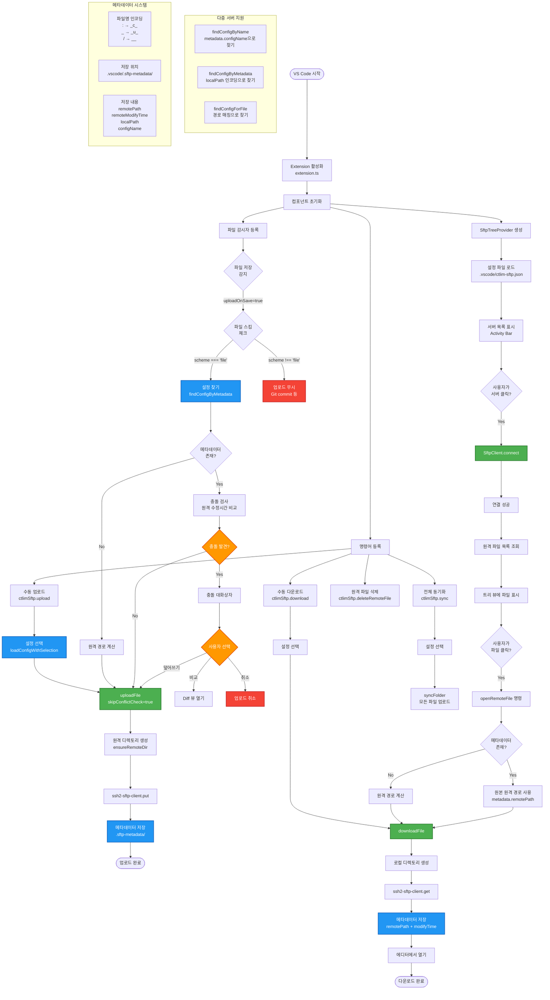
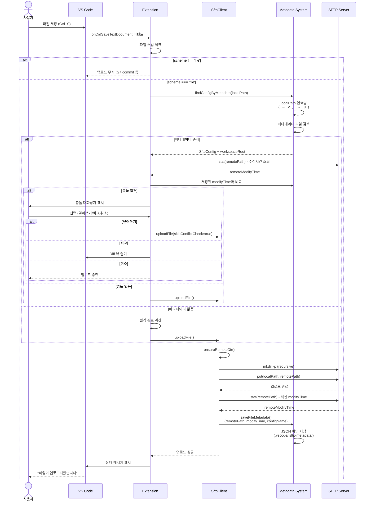
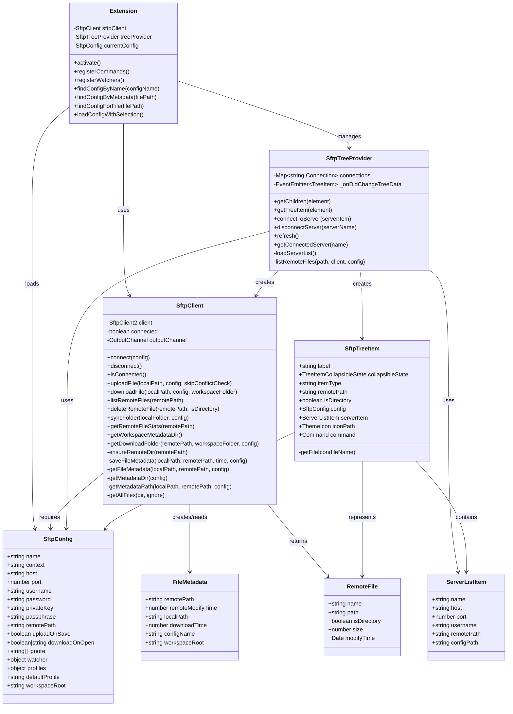
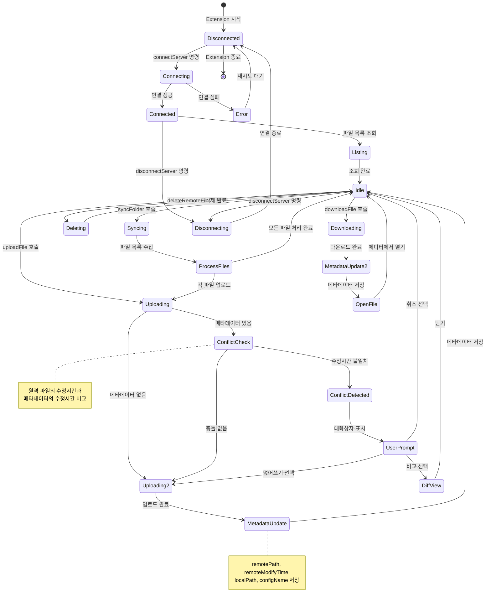
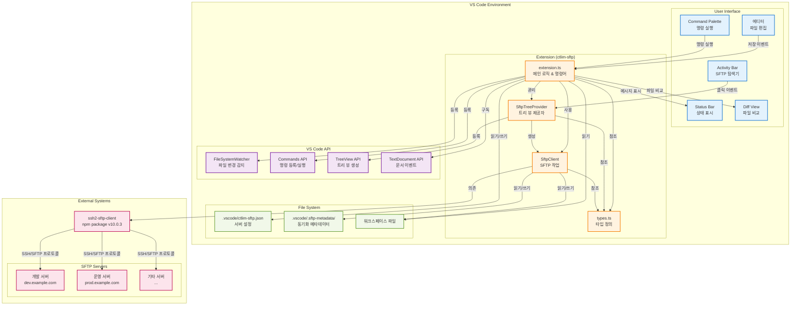
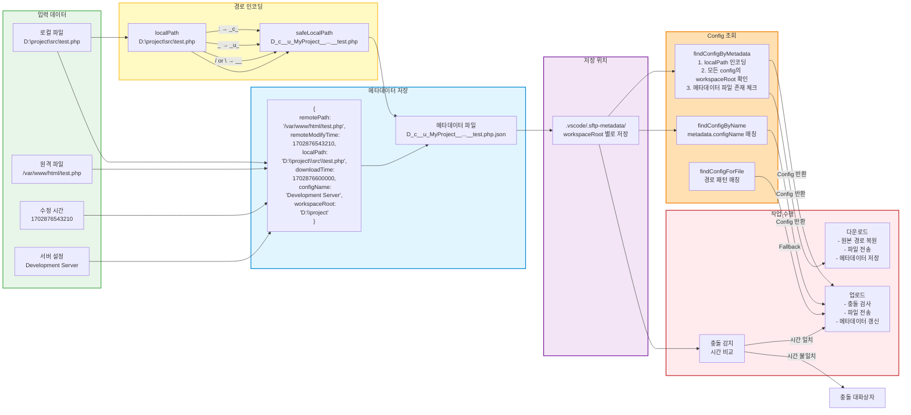

# ctlim SFTP Extension - 아키텍처 문서

## 📋 목차
1. [전체 플로우차트](#전체-플로우차트)
2. [시퀀스 다이어그램](#시퀀스-다이어그램)
3. [클래스 다이어그램](#클래스-다이어그램)
4. [상태 다이어그램](#상태-다이어그램)
5. [시스템 아키텍처](#시스템-아키텍처)
6. [데이터 플로우](#데이터-플로우)

---

## 전체 플로우차트

확장 프로그램의 전체 작동 흐름을 보여줍니다.

---

## 시퀀스 다이어그램

파일 업로드 시 컴포넌트 간 상호작용을 시간 순서로 표현합니다.

---

## 클래스 다이어그램

코드의 클래스 구조와 관계를 표현합니다.

---

## 상태 다이어그램

서버 연결 및 파일 작업의 상태 전환을 표현합니다.

---

## 시스템 아키텍처

전체 시스템의 구성 요소와 관계를 표현합니다.

---

## 데이터 플로우

메타데이터 시스템의 데이터 처리 흐름을 표현합니다.

---

## 📝 주요 개념 설명

### 메타데이터 인코딩
로컬 파일 경로를 안전한 파일명으로 변환:
- `:` → `_c_` (colon)
- `_` → `_u_` (underscore)
- `/` 또는 `\` → `__` (double underscore)

### Config 조회 우선순위
1. **findConfigByMetadata**: 메타데이터 파일 존재 기반 (가장 정확)
2. **findConfigByName**: configName 필드 매칭
3. **findConfigForFile**: 경로 패턴 매칭 (fallback)

### 충돌 감지 메커니즘
1. 다운로드 시 `remoteModifyTime` 저장
2. 업로드 전 현재 원격 파일 시간 조회
3. 불일치 시 사용자 선택:
   - 덮어쓰기
   - 비교 (Diff 뷰)
   - 취소

### 다중 서버 지원
각 서버 config는 독립적인 `workspaceRoot`를 가지며, 메타데이터는 각 workspaceRoot의 `.vscode/.sftp-metadata/` 디렉토리에 저장됩니다.

---

## 🔧 기술 스택

- **언어**: TypeScript (ES2020, strict mode)
- **플랫폼**: VS Code Extension API v1.85.0+
- **SFTP 라이브러리**: ssh2-sftp-client v10.0.3
- **지원 프로토콜**: SSH/SFTP with legacy algorithms

---

생성일: 2025-12-18
